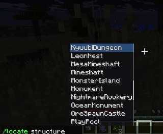
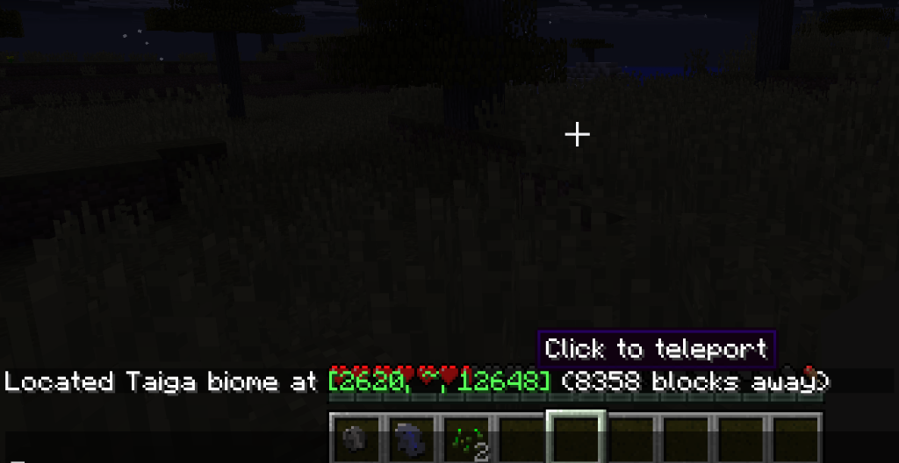

# LocateBackport (Minecraft 1.7.10)

[](https://minecraft.net/)
[](https://files.minecraftforge.net/)

A backport of the modern **`/locate`** command (both **structures** and **biomes**) to Minecraft 1.7.10, featuring clickable coordinates, teleport tooltips, tab completion, out-of-the-box mod support, and an extensible developer API.

---

## 🌟 Features

- **Modern `/locate` syntax:**
  - `/locate <structure|biome> <name>`
  - `/locate <name>` (intelligent shorthand — searches structures first, then biomes)
- **Interactive Chat Coordinates:**
  - Coordinates in chat are highlighted in green.
  - **Hover Tooltip:** Hovering over the coordinates displays a clean **"Click to teleport"** tooltip.
  - **Click to Suggest:** Clicking the coordinates automatically inserts `/tp <PlayerName> <X> ~ <Z>` directly into the chat input bar for instant teleportation.
- **Full Tab Completion:** Autocompletes available structure and biome names right in the chat.
- **Built-in Mod Support:**
  - **Vanilla Minecraft** (Village, Stronghold, Mineshaft, Temple/Pyramid, Witch Hut, Nether Fortress)
  - **Et Futurum Requiem** (Ocean Monument, Mesa Mineshaft)
  - **OreSpawn** (King Altar, Diamond Tree, Ruby Tree, Ruby Dungeon, Basilisk Maze, Kyuubi Dungeon, Castles, Battle Towers, Floating Islands, and more)
- **Extensible API:** Easily add locate support for structures and biomes from your own mods.

---

## 📸 Screenshots

### Tab completion & autocomplete list:
*(Powered by [NewerChat](https://github.com/roggy666/NewerChat-1.7.10))*



### Click-to-teleport and hover tooltips:


---

## 💡 Recommended Mod

It is **highly recommended** to install **[NewerChat-1.7.10](https://github.com/roggy666/NewerChat-1.7.10)** alongside LocateBackport:
- Provides a modern chat popup with visual dropdown suggestions.
- Allows seamless tab-completion for all structures and biomes.
- Makes clicking coordinates and viewing hover tooltips instant and intuitive.

---

## 📖 Commands & Usage

| Command | Description | Example |
|---|---|---|
| `/locate <name>` | Locates nearest structure or biome by name or alias | `/locate Village` or `/locate Taiga` |
| `/locate structure <name>` | Locates nearest structure | `/locate structure DiamondTree` |
| `/locate biome <name>` | Locates nearest biome | `/locate biome Desert` |

---

## 🛠️ Developer API

LocateBackport provides a lightweight API for third-party mod developers to register custom structure and biome locators.

### Option 1: Direct API Registration (Compile-time dependency)

Implement `IStructureProvider` in your mod:

```java
package mymod.world;

import lol.gzmc.locatebackport.api.IStructureProvider;
import net.minecraft.world.ChunkPosition;
import net.minecraft.world.World;
import java.util.Arrays;
import java.util.List;

public class MyStructureProvider implements IStructureProvider {
    @Override
    public String getName() {
        return "MyMod:Dungeon";
    }

    @Override
    public List<String> getAliases() {
        return Arrays.asList("mydungeon", "dungeon");
    }

    @Override
    public ChunkPosition findNearest(World world, String requestedName, int playerX, int playerY, int playerZ, int maxRadiusChunks) {
        // Return ChunkPosition (block coordinates) or null
        return new ChunkPosition(100, 64, 200);
    }
}
```

Register it in `FMLInitializationEvent` or `FMLPostInitializationEvent`:
```java
if (Loader.isModLoaded("locatebackport")) {
    LocateAPI.registerStructureProvider(new MyStructureProvider());
}
```

---

### Option 2: Zero-Dependency Registration via Forge IMC (Inter-Mod-Comms)

You can register providers without including `LocateBackport` in your workspace dependencies:

```java
@Mod.EventHandler
public void init(FMLInitializationEvent event) {
    FMLInterModComms.sendMessage(
        "locatebackport",
        "registerStructureProvider",
        "mymod.world.MyStructureProvider" // Full classpath to your IStructureProvider class
    );
}
```

---

## 📜 License

This project is licensed under the MIT License.
